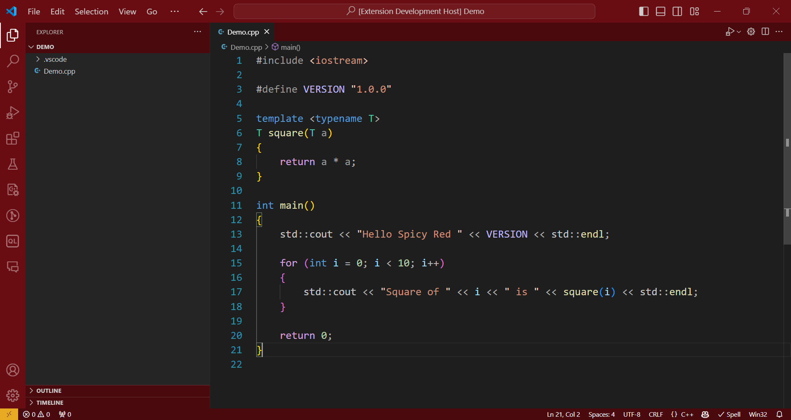
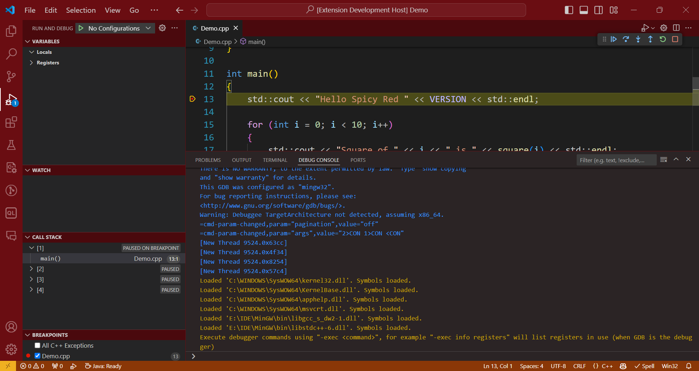

# Spicy Red Theme for VS Code

Inspired by the Spicy Red theme from Visual Studio 2022 Preview. It features frenzy red UI with syntax highlighting the same as the built-in theme "Dark (Visual Studio - C/C++)".

## Screenshots

## Installation & Usage

1. Search for **Spicy Red** in extensions sidebar.
2. Click **Install** to install the color theme.
3. Go Preferences ＞ Theme ＞ Color Theme ＞ **Spicy Red**, and enjoy! 🎉
